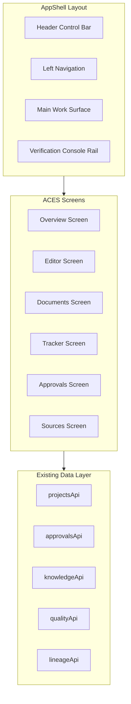

# ACES Frontend Overhaul Implementation Plan

This plan transforms the existing DoD Acquisition AI frontend into ACES with a cohesive "Light Command" theme, restructured layout, and 5 core screens using real data from existing APIs.

## Architecture Overview



## Data Sources (Existing - No Mocks)

All screens will use these existing APIs and hooks:

| Screen | Data Source | Hook/API |

|--------|-------------|----------|

| Overview | Projects, Approvals, Stats | `useDashboardStats`, `useProcurementProjects` |

| Editor | Sections, Quality, Copilot | `qualityApi`, `copilotApi`, `lineageApi` |

| Documents | Project Documents | `useProjectDocuments`, `documentGenerationApi` |

| Tracker | Phases, Steps | `projectsApi.getPhases()`, `useProcurementSteps` |

| Approvals | Pending Approvals, Audit | `approvalsApi`, `phaseTransitionsApi` |

| Sources | Knowledge Documents, RAG | `knowledgeApi`, `ragApi` |

---

## Phase 1: Theme Foundation

### 1.1 Update CSS Variables

**File:** [dod_contracting_front_end/src/index.css](dod_contracting_front_end/src/index.css)

Replace the `:root` block in `@layer base` with ACES Light Command tokens:

```css
@layer base {
  :root {
    /* ACES Light Command Theme */
    --background: 220 20% 97%;
    --foreground: 222 47% 11%;
    --card: 0 0% 100%;
    --card-foreground: 222 47% 11%;
    --popover: 0 0% 100%;
    --popover-foreground: 222 47% 11%;
    --muted: 220 18% 94%;
    --muted-foreground: 220 9% 46%;
    --border: 220 14% 88%;
    --input: 220 14% 88%;
    --ring: 221 83% 53%;
    --primary: 222 72% 24%;
    --primary-foreground: 210 40% 98%;
    --secondary: 220 18% 94%;
    --secondary-foreground: 222 47% 11%;
    --accent: 220 18% 94%;
    --accent-foreground: 222 47% 11%;
    --destructive: 0 72% 51%;
    --destructive-foreground: 210 40% 98%;
    --radius: 12px;
    
    /* ACES Semantic Colors */
    --success: 142 76% 36%;
    --success-foreground: 0 0% 100%;
    --warning: 38 92% 50%;
    --warning-foreground: 0 0% 0%;
    --info: 217 91% 60%;
    --info-foreground: 0 0% 100%;
    --ai: 263 70% 50%;
    --ai-foreground: 0 0% 100%;
  }
}
```

### 1.2 Extend Tailwind Config

**File:** [dod_contracting_front_end/tailwind.config.js](dod_contracting_front_end/tailwind.config.js)

Add semantic color extensions to the `colors` object:

```js
colors: {
  // ... existing shadcn colors ...
  success: {
    DEFAULT: 'hsl(var(--success))',
    foreground: 'hsl(var(--success-foreground))',
  },
  warning: {
    DEFAULT: 'hsl(var(--warning))',
    foreground: 'hsl(var(--warning-foreground))',
  },
  info: {
    DEFAULT: 'hsl(var(--info))',
    foreground: 'hsl(var(--info-foreground))',
  },
  ai: {
    DEFAULT: 'hsl(var(--ai))',
    foreground: 'hsl(var(--ai-foreground))',
  },
}
```

---

## Phase 2: Layout Components

### 2.1 Create Layout Folder Structure

```
src/components/layout/
├── AppShell.tsx          # Main layout wrapper
├── Header.tsx            # Top control bar with ACES branding
├── LeftNav.tsx           # System index sidebar
├── ConsoleRail.tsx       # Collapsible right verification panel
└── index.ts              # Barrel export
```

### 2.2 ConsoleRailContext

**File:** `src/contexts/ConsoleRailContext.tsx`

Manages rail state globally with route-aware defaults:

```typescript
interface ConsoleRailContextType {
  isOpen: boolean;
  activeTab: 'quality' | 'issues' | 'citations' | 'fields' | 'audit';
  toggleRail: () => void;
  openRail: (tab?: string) => void;
  closeRail: () => void;
  setActiveTab: (tab: string) => void;
}
```

Default behavior:

- Open on: Editor, Approvals
- Closed on: Overview, Documents, Tracker, Sources

### 2.3 AppShell Component

**File:** `src/components/layout/AppShell.tsx`

Structure using existing `react-resizable-panels`:

```tsx
<div className="h-screen flex flex-col bg-background">
  <Header />
  <div className="flex-1 flex overflow-hidden">
    <LeftNav />
    <ResizablePanelGroup direction="horizontal">
      <ResizablePanel>{children}</ResizablePanel>
      <ConsoleRail />
    </ResizablePanelGroup>
  </div>
</div>
```

### 2.4 Header Component

**File:** `src/components/layout/Header.tsx`

Replace current header in [AIContractingUI.tsx](dod_contracting_front_end/src/components/AIContractingUI.tsx) (lines 173-230):

- Logo: "ACES" with subtitle "Acquisition Contracting Enterprise System"
- Project switcher dropdown (using `useProcurementProjects`)
- Global search (future: search across projects)
- NotificationCenter (existing component)
- User menu (existing dropdown)
- "Synced" indicator for real-time status

### 2.5 LeftNav Component

**File:** `src/components/layout/LeftNav.tsx`

Vertical navigation replacing current horizontal nav:

```typescript
const navItems = [
  { id: 'overview', label: 'Overview', icon: Home, route: 'OVERVIEW' },
  { id: 'editor', label: 'Editor', icon: FileText, route: 'EDITOR' },
  { id: 'documents', label: 'Documents', icon: FolderOpen, route: 'DOCUMENTS' },
  { id: 'tracker', label: 'Tracker', icon: TrendingUp, route: 'TRACKER' },
  { id: 'approvals', label: 'Approvals', icon: UserCheck, route: 'APPROVALS' },
  { id: 'sources', label: 'Sources', icon: Database, route: 'SOURCES' },
  { id: 'settings', label: 'Settings', icon: Settings, route: 'SETTINGS' },
];
```

Collapsible to icon-only mode (64px) or expanded (200px).

### 2.6 ConsoleRail Component

**File:** `src/components/layout/ConsoleRail.tsx`

Collapsible right panel with 5 tabs:

- **Quality**: InstrumentCards for Confidence, Compliance Risk, Evidence Coverage, Readability (using `qualityApi.analyze()`)
- **Issues**: List from `qualityApi` breakdown with severity badges
- **Citations**: List from document citations with EvidenceChip hover
- **Fields**: From `GuidedFlowState` (existing types in [guidedFlow.ts](dod_contracting_front_end/src/types/guidedFlow.ts))
- **Audit**: AuditTimeline using `approvalsApi.getAuditTrail()`

---

## Phase 3: Shared Components

### 3.1 Create Shared Folder

```
src/components/shared/
├── StatusChip.tsx        # Semantic status badges
├── EvidenceChip.tsx      # Citation inline chips
├── InstrumentCard.tsx    # Metrics display cards
├── ActionStrip.tsx       # Page-level action bar
├── AuditTimeline.tsx     # Timeline component
├── DependencyCallout.tsx # Amber dependency warning
├── DocumentCard.tsx      # Document tile component
└── index.ts
```

### 3.2 StatusChip Component

Maps status to semantic colors (strict rules):

```typescript
const statusConfig = {
  approved: { bg: 'bg-success', fg: 'text-success-foreground', icon: CheckCircle },
  in_progress: { bg: 'bg-info', fg: 'text-info-foreground', icon: Clock },
  needs_review: { bg: 'bg-warning', fg: 'text-warning-foreground', icon: AlertTriangle },
  blocking: { bg: 'bg-destructive', fg: 'text-destructive-foreground', icon: XCircle },
  ai_generated: { bg: 'bg-ai', fg: 'text-ai-foreground', icon: Sparkles },
};
```

### 3.3 EvidenceChip Component

Uses existing HoverCard from shadcn/ui:

```tsx
// Click handler opens ConsoleRail to Citations tab
const handleClick = () => {
  openRail('citations');
  // Highlight citation in rail
};
```

Data from `lineageApi.getChunkContent()` for tooltip preview.

### 3.4 InstrumentCard Component

Displays metrics from `qualityApi.analyze()` response:

```typescript
interface InstrumentCardProps {
  label: string;
  value: number; // 0-100
  riskLevel?: 'LOW' | 'MEDIUM' | 'HIGH';
  breakdown?: QualityBreakdown[keyof QualityBreakdown];
}
```

Uses Progress component with color based on value thresholds.

### 3.5 AuditTimeline Component

Uses existing `ApprovalAuditLog` type from [api.ts](dod_contracting_front_end/src/services/api.ts) (line 441):

```typescript
interface AuditTimelineProps {
  events: ApprovalAuditLog[];
  onEventClick?: (event: ApprovalAuditLog) => void;
}
```

### 3.6 DependencyCallout Component

For Tracker screen when dependencies are missing:

```typescript
interface DependencyCalloutProps {
  missingDependencies: string[];
  onResolve: () => void; // Opens Sheet with resolution steps
}
```

Uses `documentGenerationApi.checkDependencies()` data.

### 3.7 DocumentCard Component

Tile for Documents screen:

```typescript
interface DocumentCardProps {
  document: ProjectDocument; // From useProjectDocuments
  onView: () => void;
  onExport: (format: 'pdf' | 'docx' | 'markdown') => void;
  onSelect: (selected: boolean) => void;
  isSelected: boolean;
}
```

Shows StatusChip, generation_status badge, last_updated.

---

## Phase 4: Screen Implementations

### 4.1 Overview Screen

**File:** `src/components/screens/OverviewScreen.tsx`

Refactor existing [DashboardView.tsx](dod_contracting_front_end/src/components/dashboard/DashboardView.tsx):

- **Data Source**: `useDashboardStats()` hook (existing)
- **Components**:
  - InstrumentCards row: Total Projects, In Progress, Pending Approvals, Compliance Issues
  - Quick Actions grid (existing `QuickActionsGrid`)
  - Recent Projects list (existing `RecentProjectsList`)
- **ConsoleRail**: Closed by default

### 4.2 Editor Screen

**File:** `src/components/screens/EditorScreen.tsx`

Wrap existing [LiveEditor.tsx](dod_contracting_front_end/src/components/LiveEditor.tsx) (~2000 lines) in AppShell:

- **Layout**: 3-pane using existing `react-resizable-panels`
  - Left: Outline tree (existing section navigation)
  - Center: Document canvas with TipTap (existing RichTextEditor)
  - Right: ConsoleRail (extract from current right panel)
- **Data Sources**:
  - `qualityApi.analyze()` for instrument metrics
  - `copilotApi.assist()` for AI tools
  - `lineageApi.getLineage()` for citations
- **AI Selection Popover**: Refactor existing `EditorCopilot` to show on text selection:
  - Actions: Rewrite, Expand, Summarize, Compliance Check, Add Citation
  - Results appear as inline diff or right-side preview (existing `FixPreviewModal`)
- **ConsoleRail**: Open by default, shows Quality tab

### 4.3 Documents Screen

**File:** `src/components/screens/DocumentsScreen.tsx`

New screen combining document management:

- **Data Source**: `useProjectDocuments(projectId)`
- **Features**:
  - Grid/List view toggle
  - DocumentCard tiles with StatusChip
  - Batch selection with checkboxes
  - Export dropdown: PDF, DOCX, JSON using `documentGenerationApi.exportBatch()`
  - Primary CTA: "Download Batch"
  - Secondary: "Export JSON", "Run Checks"
- **Filter**: By status, phase, generation_status
- **ConsoleRail**: Closed by default

### 4.4 Tracker Screen

**File:** `src/components/screens/TrackerScreen.tsx`

Wrap existing [ProcurementTracker.tsx](dod_contracting_front_end/src/components/procurement/ProcurementTracker.tsx):

- **Data Sources**:
  - `projectsApi.getPhases(projectId)`
  - `useProcurementSteps(projectId)`
  - `documentGenerationApi.checkDependencies()`
- **Components**:
  - Phase progress strip (existing `ProcurementTrackerBar`)
  - Steps checklist table (existing `PhaseSteps`)
  - DependencyCallout when `dependencies_met === false`
- **ConsoleRail**: Closed by default, opens on dependency click

### 4.5 Approvals Screen

**File:** `src/components/screens/ApprovalsScreen.tsx`

Refactor existing [PendingApprovalsView.tsx](dod_contracting_front_end/src/components/procurement/PendingApprovalsView.tsx):

- **Data Sources**:
  - `approvalsApi.getPendingApprovals()`
  - `phaseTransitionsApi.getPendingTransitions()`
  - `approvalsApi.getAuditTrail(approvalId)`
- **Layout**:
  - Table with columns: Document, Requester, Approver, Status, Due, Last Action
  - Row click opens detail view
- **Detail View**:
  - Center: Document preview snippet
  - ConsoleRail: Open with Audit tab showing AuditTimeline
- **Actions**: Approve, Reject, Delegate (existing functionality)

### 4.6 Sources Screen

**File:** `src/components/screens/SourcesScreen.tsx`

Refactor existing [UploadCenter.tsx](dod_contracting_front_end/src/components/UploadCenter.tsx) and [KnowledgeTab.tsx](dod_contracting_front_end/src/components/procurement/KnowledgeTab.tsx):

- **Data Sources**:
  - `knowledgeApi.getProjectKnowledge(projectId)`
  - `knowledgeApi.getStats(projectId)`
  - `ragApi.getStats()`
- **Layout**:
  - Upload cards by category: Regulations, Templates, Past Contracts
  - Uploaded file list with indexing status (spinner -> check)
  - "Context Set" summary panel with counts
- **Upload**: Uses `knowledgeApi.uploadToProject()`
- **ConsoleRail**: Closed by default

---

## Phase 5: Router and Integration

### 5.1 Update Route Types

**File:** [AIContractingUI.tsx](dod_contracting_front_end/src/components/AIContractingUI.tsx)

Update `RouteType`:

```typescript
type RouteType = 
  | 'OVERVIEW'      // Was DASHBOARD
  | 'EDITOR'
  | 'DOCUMENTS'     // New
  | 'TRACKER'       // Was PROCUREMENT_TRACKER
  | 'APPROVALS'     // Was PENDING_APPROVALS
  | 'SOURCES'       // Was UPLOAD_CENTER
  | 'SETTINGS'      // New
  | 'GENERATING';   // Keep for generation progress
```

### 5.2 Wrap with AppShell

Replace the current layout div in `MainApp()` with:

```tsx
<AppShell>
  <ConsoleRailProvider>
    {/* Screen routing */}
  </ConsoleRailProvider>
</AppShell>
```

### 5.3 Branding Updates

Search and replace throughout codebase:

- "DoD Acquisition AI" → "ACES"
- "DoD AI acquisitions" → "Acquisition Contracting Enterprise System"
- Update favicon and logo assets

---

## Phase 6: Final Polish

### 6.1 Remove Unused Components

After migration, remove:

- Old header from `AIContractingUI.tsx`
- Redundant `NavButton` component
- Deprecated route handlers

### 6.2 Consolidate CSS

Merge into organized structure:

- `index.css` - Theme variables only
- `editor-styles.css` - Editor-specific styles (keep)
- Remove `App.css`, `guidedFlow.css` (move needed styles to index.css)

### 6.3 WebSocket Integration

Add "Synced" indicator in Header using existing `createWebSocket()` from [api.ts](dod_contracting_front_end/src/services/api.ts) (line 929).

---

## File Changes Summary

| Action | Path |

|--------|------|

| Modify | `src/index.css` |

| Modify | `tailwind.config.js` |

| Create | `src/components/layout/AppShell.tsx` |

| Create | `src/components/layout/Header.tsx` |

| Create | `src/components/layout/LeftNav.tsx` |

| Create | `src/components/layout/ConsoleRail.tsx` |

| Create | `src/components/layout/index.ts` |

| Create | `src/contexts/ConsoleRailContext.tsx` |

| Create | `src/components/shared/StatusChip.tsx` |

| Create | `src/components/shared/EvidenceChip.tsx` |

| Create | `src/components/shared/InstrumentCard.tsx` |

| Create | `src/components/shared/ActionStrip.tsx` |

| Create | `src/components/shared/AuditTimeline.tsx` |

| Create | `src/components/shared/DependencyCallout.tsx` |

| Create | `src/components/shared/DocumentCard.tsx` |

| Create | `src/components/shared/index.ts` |

| Create | `src/components/screens/OverviewScreen.tsx` |

| Create | `src/components/screens/EditorScreen.tsx` |

| Create | `src/components/screens/DocumentsScreen.tsx` |

| Create | `src/components/screens/TrackerScreen.tsx` |

| Create | `src/components/screens/ApprovalsScreen.tsx` |

| Create | `src/components/screens/SourcesScreen.tsx` |

| Modify | `src/components/AIContractingUI.tsx` |

| Modify | `src/components/LiveEditor.tsx` (extract ConsoleRail content) |

| Delete | `src/App.css` (after migration) |